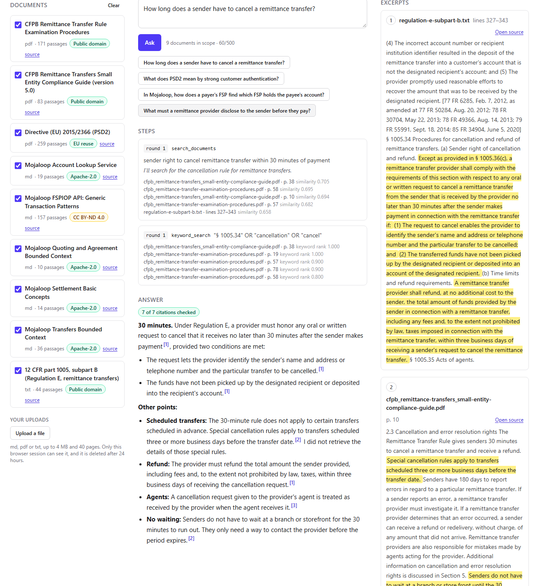

# cited-rag-agent

An agent that answers questions about a pack of cross-border payments documents and shows how it got there. Claude searches the documents with tools and cites passages, and every citation is checked against the stored text before it is marked checked.

**Live on Sandbox:** https://cited-rag-agent-git-sandbox-privlin.vercel.app



## How a citation is checked

1. The search tools return passages to Claude as `search_result` blocks, one per chunk, each holding the chunk's sentences as separate content blocks, with citations enabled. A citation names a result by index and a range of sentence blocks inside it.
2. The server keeps one list of every `search_result` it sent in the run. A citation's index points into that list, across all rounds.
3. For each cited sentence block the check confirms that the index is in range, that the result's chunk exists and belongs to a document in scope, and that the block text equals the block at the same position when the stored chunk is split again and appears in the stored chunk text. It compares block by block and never uses `cited_text` as one string.
4. The file and page shown come from the database row, never from the model's text. A citation that fails shows as "unchecked".

**What "checked" proves:** the cited sentences are in the stored text of a passage retrieved in that run. **What it does not prove:** that the sentence supports the claim it is attached to. The highlighted excerpt is there for a reader to judge that.

## The agent loop

Claude Sonnet 5.5 runs a tool loop of at most six rounds with four tools: `search_documents` (semantic), `keyword_search` (exact terms), `read_neighbours` and `list_documents`. Search results come back as `search_result` blocks, and the loop keeps one global block index across rounds. Each step streams to the page as newline-delimited JSON. When the model stops, the check runs. If embedding the query fails, the search falls back to keywords and the step says so.

Document text is data, not instructions. A hostile document can steer the prose of an answer but cannot forge a checked citation, because the check runs in code on the stored text.

## Stack

Next.js 16 (App Router) and React 19 on Vercel; TypeScript; Tailwind 4. Postgres 18 with pgvector on Neon: HNSW for semantic search and a generated `tsvector` for keywords. Voyage `voyage-4` embeddings. The Anthropic Messages API through `@anthropic-ai/sdk`. Vitest, with PGlite standing in for Postgres.

## Limits and cost

- Per address: 15 questions an hour and 10 uploads a day.
- Uploads: one `.md`, `.pdf` or `.txt` file of at most 4 MB, 40 pages and 100,000 estimated tokens, deleted after 24 hours.
- Spend: $1 a day for the model, with $0.10 held for each question while it runs, and 2M embedding tokens a day.
- Measured over 12 runs of the four example questions: $0.0365 and 7.8 s per question on average.

## Running locally

Copy `.env.example` to `.env.local`, fill in the keys, then run these from the repo root.

```bash
npm ci
npm run migrate        # apply db/migrations to the database in .env.local
npm run ingest:corpus  # embed the nine documents (needs Voyage)
npm run dev            # http://localhost:3000
npm run lint && npm run typecheck && npm test && npm run build
npm run smoke:sql      # every SQL statement through postgres.js, rolled back
```

`npm run corpus:fetch` re-downloads the documents from their sources and rewrites the manifest.

## Corpus

Nine documents, committed under `corpus/files/` with their sources, licences and hashes in [corpus/manifest.json](corpus/manifest.json): three US federal texts on remittance transfers (public domain), the PSD2 directive (EU reuse, source acknowledged), and five Mojaloop documentation pages (Apache-2.0, except the generic transaction patterns page, which states CC BY-ND 4.0).

## The chain

[Intent](intent/2026-10-07-mvp/intent.md) · [Spec](intent/2026-10-07-mvp/spec.md) · [Plan](intent/2026-10-07-mvp/plan.md) · [Review of the first spec and plan drafts](intent/2026-10-07-mvp/review-2026-10-07.md)

The Python prototype this repo started as is kept at the tag `python-prototype`.

## Status

First cut, running on Sandbox. Next: retrieval evals in CI (M4), then the QA and production environments (M5).

## Local secrets

<!-- yanshuf-secrets -->

`.env.local` holds Sandbox credentials only and is kept in Paul's encrypted secrets archive. The key names are in `.env.example`.
